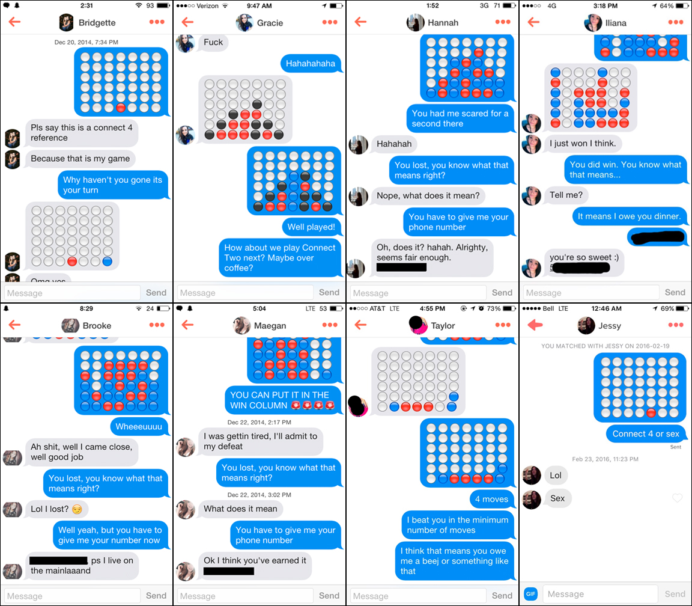

title: Connect Four Artificial Intelligence
date_clean: July 7th 2016
date: 2016-07-07
images: True
tags: [games, python, artificial intelligence]
styles: [connect_four.css]
scripts: [connect_four.js]

To keep you motivated as you read this post, I'll let you know that you get to play a game once you finish. Or you can just say screw all these words, and skip straight to the game [now](#game-title). That's what I would do.

The push to advance the state artificial intelligence in leisurely games most likely began when single children grew sick of playing solitaire. Probably because that game is fucking impossible to beat (statistically over 20% of solitaire games are unbeatable, however a true player can expect to win at least [43% of the time](http://www.jupiterscientific.org/sciinfo/KlondikeSolitaireReport.html)). The first machine ever to give the illusion of competitive sentience came in 1770, with the creation of a chess-playing automaton called [the Turk](https://en.wikipedia.org/wiki/The_Turk). A nearly unstoppable creation - the Turk managed to take down opponents such as Benjamin Franklin, Catherine the Great, and Napoleon. Of course, the Turk turned out to be a hoax, when it was revealed that  the CPU inside of the machine was just a little Hungarian man trying to impress the Empress. It wasn't until over 200 years later, with the creation of IBM's [Deep Blue](https://en.wikipedia.org/wiki/Deep_Blue_(chess_computer)), that a computer finally beat a reigning world champion in both a game and match of chess.

Instead of chess, this article focuses on the implementation of a common game-play search algorithm in the game [Connect Four](https://en.wikipedia.org/wiki/Connect_Four). And knowing that I can't hide inside of your computer and play connect four against you, I had no other choice than to write a program that can play the game efficiently itself.

Assuming you had a childhood, you're probably familiar with Connect Four. Or if you were one of Captain Cook's shipmates you may know it as [Captain's Mistress](http://www.tradgames.org.uk/games/Four-in-a-row.htm). Seriously though, the game is pretty damn sexy. There's no wonder it's such a popular way to break the ice on Tinder. 

    

Just as a refresher, here is a quick overview of the rules:

1. Two players take turns dropping a disc into a 6x7 slot game board (classic game dimensions). This means there are 4,531,985,219,092 positions for all game boards populated with 0 to 42 discs
2. The discs stack vertically from the lowest available row
3. The game ends when either a player has aligned four of their discs in a row (horizontally, vertically, or diagonally) or when there are no more available slots

A game of Connect Four has [perfect information](https://en.wikipedia.org/wiki/Perfect_information) (just like chess), meaning at all times each player is completely aware of every move that has occurred thus far, as well as all moves that can further take place. This makes it a great game for the Monte Carlo tree search, a heuristic search algorithm which I will discuss more about soon. Apparently most games are just math problems that can be [solved](https://xkcd.com/1002/), and Connect Four itself was solved in 1995. It has been [proven](http://www.informatik.uni-trier.de/~fernau/DSL0607/Masterthesis-Viergewinnt.pdf) that the first player, when playing with optimal strategy, can _always_ force a win.

Making decisions isn't always easy. I've spent more time on Netflix scrolling through shows to choose than I have actually spent watching them. Many people give up their spot in line at McDonalds while they stare at the dollar menu as if it's the Sistine Chapel ceiling. For a computer to make a decision, it needs to follow a set of rules. In this article, we're going to explore a specific search algorithm commonly utilized in game play, known as the [Monte Carlo tree search](https://en.wikipedia.org/wiki/Monte_Carlo_tree_search) (MCTS) - not to be confused with arguably the most delicious [sandwich](http://shewearsmanyhats.com/monte-cristo/) in the history of human culture.

MCTS has gained a lot of popularity in the last decade. Since 2006, several AI milestones were achieved in the game [Go](http://www.remi-coulom.fr/JFFoS/JFFoS.pdf), a game that is extremely difficult for computers to outsmart humans in due to a large [branching factor](https://en.wikipedia.org/wiki/Branching_factor), using MCTS. It's important to note though that not every decision process is equal. MCTS may be a good option for determining the next column to play in a game of Connect Four, but has no application as far as determining the name of your first born child. 

MCTS can be broken down into four main components:

1. *Selection*: Starting from the root state, select child nodes (i.e. select a legal column to play). Typically selection continues as long as you have statistics on each child column, where the chosen column is the one with the most favorable statistics thus far (i.e. the column that has returned the highest winning percentage)
2. *Expansion*: If that selection did not end up with a win, loss, or draw, and you no longer have statistics for all possible child columns, choose a the next child node at random (i.e. select the next column for your disc randomly to *expand* your stats)
3. *Simulation*: Play out an entire game starting from that expanded selection
4. *Backpropagation*: Use the results from the simulation to backpopulate the win-percentage stats for the columns from the expansion back to the root. Those win-percentage stats can be used for future selection steps as well as when it comes time to finally return a decision on which column to play

So just to drill that process into your head, with MCTS you will select columns you know are good until you reach an unknown option, expand in the direction of the unknown, simulate the results of the unknown, and backpropogate the game statistics of the columns leading up to that point based on the simulation results.

Now, let's take what we know about the Monte Carlo flow and implement a working example as a mini javascript game. We'll assume the connect four game engine is already implemented, and just go over the AI player construction.

We'll start by creating a private scope for our AI with the main functions highlighted:

<pre class="get-away"><code class="language-javascript">var MonteCarloPlayer = (function() {

  function checkWinner(state) {
    // return true if a player has won on the given state
    // and the ID of the winning player
  }
  
  function legalMoves(state) {
    // return array of legal columns that can be played
  }
  
  function getNextState(column, currState) {
    // given the column to be played and the current state of the game
    // return the next map state with the column being filled
  }

  function getPlay(map, timeLimit) {
    ...
  }

  function runSimulation() {
    ...
  }

  return {
    getPlay: getPlay
  };

})();
</code></pre>

Let's assume, for simplicity, that <code class="inline">checkWinner()</code>, <code class="inline">legalMoves()</code>, and <code class="inline">getNextState()</code> are already implemented and work as expected. We'll focus our attention on implementing both <code class="inline">getPlay()</code> and <code class="inline">runSimulation()</code>. When it is the AI's turn to drop his (or her, or it, or whatever) connect four piece, the game engine will call <code class="inline">getPlay()</code> and pass along the current state of the board as well as a time limit (in seconds) that the AI must respond by. The AI will be expected to return an integer from 0 to 6, which represents the column to play.

The <code class="inline">getPlay()</code> function essentially has 3 parts. First, run as many simulations as possible in the given time limit. Second, analyze the results of those simulated plays. And finally, return the column which had the highest winning percentage of all those simulations. We'll now add in the first part of that process (running the simulations):

<pre class="get-away"><code class="language-javascript">function getPlay(map, timeLimit) {
  var startTime = new Date().getTime();
  var legal = legalMoves(map);
  // If there is only one legal move just return it now
  if (legal.length === 1) {
    return legal[0];
  }
  var gamesPlayed = 0;
  while (new Date().getTime() - startTime < timeLimit) {
    gamesPlayed++;
    runSimulation(map);
  }
  // TODO: Analyze the results and return a play
}
</code></pre>

At this point, <code class="inline">getPlay()</code> is just calling <code class="inline">runSimulation()</code> as many times as it can within the given time limit. The current state of the board is stored as a 2D array in the variable <code class="inline">map</code>, which is passed into the simulation. You can imagine <code class="inline">map</code> as a 6x7 2D array of integers, where 0 represents a free cell, 1 represents a cell filled by an opponent's piece, and 2 represents a cell filled by our AI's piece.

Let's jump into the simulation now to see how we're running these games and what stats we are recording:

<pre class="get-away"><code class="language-javascript">var plays = {};
var wins = {};

function runSimulation(state) {
  var visitedStates = [];
  var player = 2; // Let's assume the AI is player 2
  var expand = true;
  var winnerId = 0;
  // Games are short enough that we don't have to put limit on number of moves
  while (true) {
    legal = legalMoves(state);
    if (legal.length === 0) {
      break;
    }

    play = legal[Math.floor(Math.random() * legal.length)];
    state = getNextState(play, _copyState(state));

    // While in expansion mode, initialize our stats for the new exploration
    if (expand && !([player, state] in plays)) {
      expand = false;
      plays[[player, state]] = 0;
      wins[[player, state]] = 0;
    }

    // Keep track of every visited state
    if (visitedStates.indexOf([player, state]) === -1) {
      visitedStates.push([player, state]);
    }

    winner = checkWinner(state);
    if (winner.status === true) {
      winnerId = winner.winnerId;
      break;
    }
    
    // Switch up the player for the next move
    player = (player === 1) ? 2 : 1;
  }
  // TODO: Now that we have a winner, add stats to plays/wins
}
</code></pre>

We will be recording our game statistics in <code class="inline">plays</code> (states mapped to number of times played) and <code class="inline">wins</code> (states mapped to number of times the player won).

Our simulation starts at the current board state. The AI gets a list of all legal moves (columns which are still available to drop a piece in) and randomly selects one of those columns. It's important to note here that the selection process is completely random, which is NOT an optimal strategy for MCTS. We could be exploiting our knowledge of previously played legal moves to focus our simulations on more promising columns. But fuck that optimization process right now, let's keep our MCTS implementation as simple as possible so we can really see what it's trying to accomplish.

When our simulation decides to play a column in a state that it has not encountered before, it adds that new state to <code class="inline">plays</code> and <code class="inline">wins</code>. All we do here is initialize those values as 0. In the next step we will go over all <code class="inline">visitedStates</code> and increment those stats based on the results. The simulation continues until either a winner is found, or there are no more legal moves (meaning a draw).

Once the simulation is finished, it is time to update the stats:

<pre class="get-away"><code class="language-javascript">// Finishing runSimulation() ...
for (var i = 0; i < visitedStates.length; i++) {
  player = visitedStates[i][0];
  state = visitedStates[i][1];
  // If the play was not part of any exploration, ignore it
  if (!([player, state] in plays)) {
    continue;
  }
  plays[[player, state]] += 1;
  if (player === winnerId) {
    wins[[player, state]] += 1;
  }
}
</code></pre>

We look at every state we visited during our simulation while incrementing the <code class="inline">plays</code> count for each relevant state, and if the player of that state was the winner of the overall simulation we also increment <code class="inline">wins</code>. Keep in mind both <code class="inline">plays</code> and <code class="inline">wins</code> are in <code class="inline">MonteCarloPlayer</code>'s scope, so are incrementally updated with every call of <code class="inline">runSimulation()</code>.

Now that we have all of our stats, let's finish with the final section of <code class="inline">getPlay()</code> (calculating and returning the best column):

<pre class="get-away"><code class="language-javascript">// Finishing getPlay() ...
// Analyze the plays/wins and return highest win percentage column
var play;
var movesStates = [];
var percentages = {};
for (var legalIndex in legal) {
  movesStates.push([legal[legalIndex], getNextState(legal[legalIndex], _copyState(map))]);
}
for (var i = 0; i < movesStates.length; i++) {
  play = [2, movesStates[i][1]];
  if (play in wins) {
    percentages[movesStates[i][0]] = wins[play] / plays[play];
  } else {
    percentages[movesStates[i][0]] = 0;
  }
}
var maxPlay = Object.keys(percentages).reduce(function(a, b) {
  return percentages[a] > percentages[b] ? a : b;
});
return parseInt(maxPlay);
</code></pre>

Ignoring my inconsistency on how I loop over arrays, we see this final process is just about assigning winning percentages to each legal column choice and then returning the column with the highest winning percentage. Cool.

So that's it, in a very unoptimized nutshell. Time to play with the final result. Do you think you have what it takes to beat <code class="inline">MonteCarloPlayer</code>? You can find out by playing against it below. To avoid having my ass sued by Hasbro for copyright infringement, the name of the game you are about to play is called Cohere Four and it uses blue and orange pieces as oppose to the classic red and yellow.

<h3 id="game-title">Cohere Four</h3>

  <canvas id="connect-four" height="480" width="640"></canvas>
  <canvas id="ai-output" height="100" width="640"></canvas>

  You haven't played any games yet. Try playing a game above to test the effectiveness of the MCTS in a game of Connect Four.

  You have proven to be a worthy opponent thus far, splitting 0 games evenly with the Monte Carlo AI.

  Well, this is embarrassing for Monte Carlo. You have won 0 out of 0 games. That's a 0% win rate. Perhaps you should take your talents to the next [AlphaGo](https://deepmind.com/alpha-go) competition. 

  The MCTS algorithm is so effective as Connect Four AI, that it has been able to beat you in 0 out of 0 games. That's a 0% win rate.

  Computers are fast, incase you didn't know. Although you have only played 0 games, the AI has technically finished the simulation of 0 games. You would need to play 0 games a day for an entire year to record that large of a data set.

Of course, this implementation isn't perfect. We can still improve upon the algorithm above. There are several ways to do so. First, we could penalize the score for column selection when the opponent wins on a particular move. Currently the algorithm does not take losses into account when deciding on a column. That means column 1 could have 5 wins and 5 losses on 10 simulations. Meanwhile, column 2 could have 5 wins and 5 draws. With our current algorithm both options would be treated equally. The [minimax](https://en.wikipedia.org/wiki/Minimax) decision rule takes such actions into account. For a stronger AI, losses should negatively impact the weight of column selections.

Another downside to our current algorithm is that the exploration process is completely random. We could exploit our knowledge of games we've already simulated by favoring our exploration around columns that have a good history of wins. There is a formula that can be applied to the MCTS exploration known as the Upper Confidence 1 bound applied to Trees ([UCT](https://en.wikipedia.org/wiki/Monte_Carlo_tree_search#Exploration_and_exploitation)). It involves square roots, and something about an [octopus](http://www.primarydigit.com/blog/multi-arm-bandits-explorationexploitation-trade-off) playing slot machines. The main idea behind the UCT approach is that it would balance our simulations in favor of columns that frequently return wins (exploitation) while still experimenting with all possible options (exploration).

Another area to tackle would be code optimization. The faster our code runs, the more games we are able to simulate within a single turn's time limit. The more simulations, the more accurate our results. Simple as that.

#### References, Inspirations and Further Reading
1. [The Grandmaster Hoax](http://www.theparisreview.org/blog/2012/03/28/the-grandmaster-hoax/)
1. [Connect Four Starter Code](https://codepen.io/coderontheroad/pen/GdxEo)
2. [Searching for Solutions in Games and Artificial Intelligence](http://www.aiexp.info/files/allis-thesis.pdf)
3. [Minimax Connect Four Python Implementation](https://github.com/erikackermann/Connect-Four)
4. [Some Random Cornell Course Assignment that has an illustrated Minimax Tree](http://www.cs.cornell.edu/courses/CS2110/2014sp/assignments/a4/A4ConnectFour.pdf)
5. [Battle Connect Four Bots](http://theaigames.com/competitions/four-in-a-row)
6. [Baby Santa Playing Connect Four Against Godzilla](http://www.pleated-jeans.com/wp-content/uploads/2015/12/Elf-on-shelf-connect-four-3-1.jpg)
7. [This Same Algorithm Implemented with Python](https://jeffbradberry.com/posts/2015/09/intro-to-monte-carlo-tree-search/)
8. [HTML5 Connect Four That My UI/Game Controls Are Based Off Of](https://github.com/kenrick95/c4)
