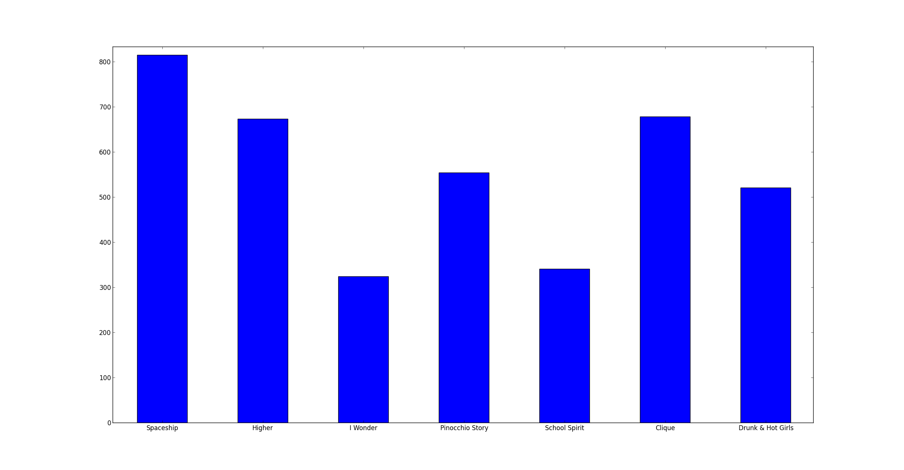

title: Kanye West Lyrical Analysis Through Time
date: 2014-10-01
tags: [music, analysis, kanye west, python, requests, beautifulsoup]

    

Some say he is the voice of this generation. Some say he likes [fish sticks](http://en.wikipedia.org/wiki/Fishsticks_(South_Park)). Regardless of what some say, Kanye himself says many things.

#####_"I’m like a vessel, and God has chosen me to be the voice and the connector."_

That of couse is coming from the same man who spoke these words:

#####_"Eatin' Asian pussy, all I need was sweet and sour sauce."_

Given such an interesting collection of comments, I was curious if there has been any pattern in Kanye's word choices over the past decade that could reflect shifts in his emotion and/or attitude. I decided to look at the lyrics of his discography - specifically his [7 studio albums](http://en.wikipedia.org/wiki/Kanye_West_discography#Studio_albums) which date from 2004 to 2013.

To collect this poetic data I wrote a simple Python script to scrape [azlyrics](http://www.azlyrics.com/). You can check out the source for the scipt [here](https://github.com/mschmo/personal-site/blob/master/server/snippets/azlyrics.py). Across the 7 albums there were a total of 109 tracks and 61,540 words (non-unique and prior to any editing).

Longest track is 'Last Call' with 2,599 words (a 12:41 track from The College Dropout). Shortest track is 'Intro' with 68 words (a 19 second skit also from The College Dropout). Interesting that Intro is the first track and Last Call is the last track on the same album.

I filtered out 127 [stopwords](http://en.wikipedia.org/wiki/Stop_words). Lower strings, join, remove unicode

In [99]: all_lyrics = ' '.join([lyrics['raw'].lower() for track, lyrics in stats['tracks'].iteritems() for album, stats in yeezy.iteritems()])
In [100]: all_lyrics = all_lyrics.encode('utf-8').decode('ascii', 'ignore')
In [114]: re.sub(r"\[^.*\['(.*)'\].*$\]", '', all_lyrics)

remove punctuatio, then split on ' '
then remove stopwords
remove 1 character words
c = Counter(lyric for lyric in split_lyrics if lyric not in stopwords)

After left with 34,073 words (55.4% of the total count).

    

<code>
    def fuck():
        return True
</code>