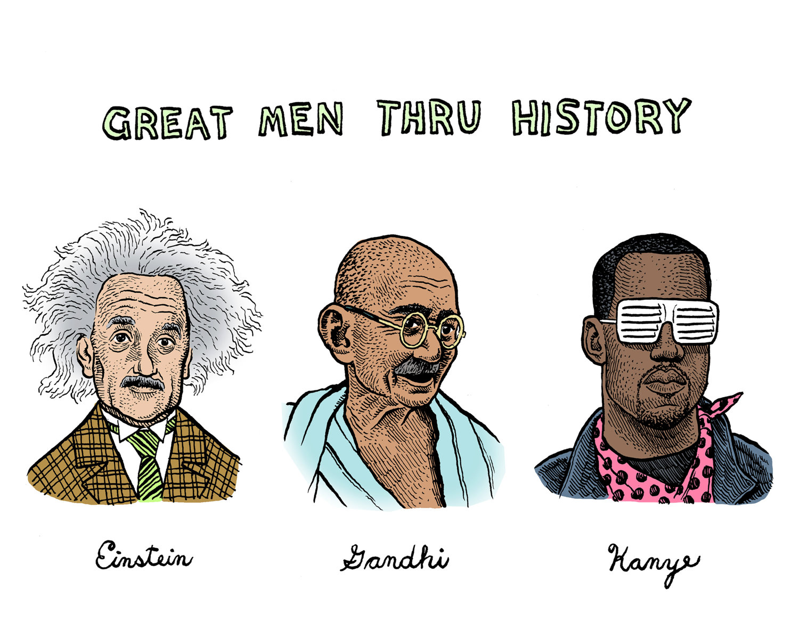

title: Lyrical Analysis of Kanye West
date: 2015-01-11
date_clean: July 9th, 2016
tags: [music, analysis, kanye west, python, requests, beautifulsoup]

    

Some say he is the voice of this generation. Some say he likes [fish sticks](http://en.wikipedia.org/wiki/Fishsticks_(South_Park)). But regardless of what some say, Kanye himself says many things.

#####_"I’m like a vessel, and God has chosen me to be the voice and the connector."_

That is the same vessel who also said:

#####_"Eatin' Asian pussy, all I need was sweet and sour sauce."_

Given such an interesting collection of comments, I was curious if there has been any pattern in Kanye's word choices over the past decade that could reflect shifts in his emotion and/or attitude. I decided to look at the lyrics of his discography - specifically his [7 studio albums](http://en.wikipedia.org/wiki/Kanye_West_discography#Studio_albums) which date from 2004 to 2013.

To collect this poetic data I wrote a simple Python script to scrape [azlyrics](http://www.azlyrics.com/). You can check out the source for the scipt [here](https://github.com/mschmo/personal-site/blob/master/snippets/azlyrics.py). Across the 7 albums there were a total of 109 tracks and 61,540 words (non-unique and prior to any editing).

Longest track is 'Last Call' with 2,599 words (a 12:41 track from The College Dropout). Shortest track is 'Intro' with 68 words (a 19 second skit also from The College Dropout). Interesting that Intro is the first track and Last Call is the last track on the same album.

I filtered out 127 [stopwords](http://en.wikipedia.org/wiki/Stop_words).

1. lowercase words
2. all_lyrics.encode('utf-8').decode('ascii', 'ignore')
3. remove punctuation, then split on ' '
4. then remove stopwords
5. remove 1 character words

After left with 34,073 words (55.4% of the total count).

<pre class="get-away"><code class="language-python">import plotly.plotly as ply
from plotly.graph_objs import *
from collections import Counter

# blackskinhead is a list of words used in Black Skinhead
labels, values = zip(*Counter(blackskinhead).most_common(5))

data = Data([Bar(x=labels, y=values)])
ply.plot(data, filename='kanye/blackskinhead')
</code></pre>

I need to......

spread this shit out......

it's getting all crammed up in hurr....

I decided to say fuck plotly, because the iframe is a pain in the ass to load. This shows the 5 most common words from Black Skinhead:

Ok, so what theme should I use. Should it be dark or light is the main question here.

The above is an example Highcharts graph. I want to see what looks good and shit.

And yeah, this shit looks good.

I'm going to probably have 3 charts. One will be a bar of total words - both filtered and unfiltered - by album. Another will be a bar of the most common words. And the third will be a line chart over time of key words (like fuck, love, bitch, happy).

#### References
1. [Common English Words](http://www.textfixer.com/resources/common-english-words.php)
2. [MusicMood](http://sebastianraschka.com/Articles/2014_musicmood.html)
3. [Natural Language Toolkit](http://www.nltk.org/)

